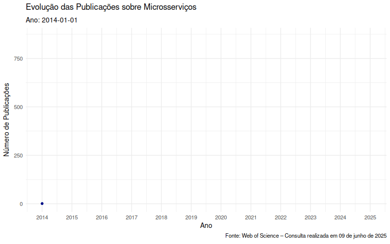
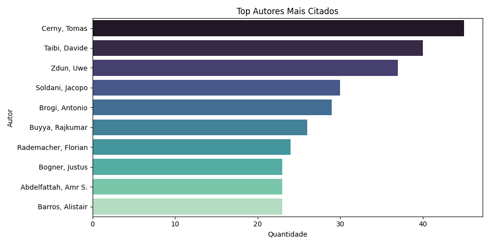
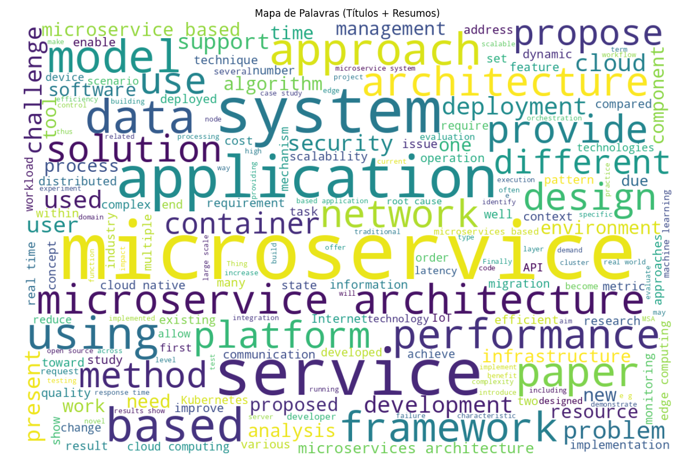

# Microservices - Microsserviços

Este repositório reúne informações, publicações e análises relacionadas ao tema de microsserviços. Aqui você encontrará dados estatísticos, artigos publicados por mim e em parceria com outros pesquisadores, além de visualizações que ajudam a compreender a evolução e os focos de estudo na área.

This repository gathers information, publications, and analyses related to microservices. It includes statistical insights, published articles authored by me and research partners, as well as visualizations to help understand the evolution and research trends in the field.

---

## My publications about microservices - Minhas publicações sobre microsserviços

- [Guidelines for the Application of Event Driven Architecture in Micro Services with High Volume of Data](https://www.scitepress.org/Papers/2025/133486/133486.pdf)
- [Microservices Patterns Recommendation based on Information Retrieval](https://doi.org/10.3897/jucs.108974)
- [Migration of monolithic systems to microservices:: A systematic mapping study](https://www.sciencedirect.com/science/article/pii/S0950584924001952)
- [Understanding and Addressing the Allocation of Microservices into Containers: A Review](https://doi.org/10.1080/03772063.2023.2205864)
- [Patterns in Microservices-based Development: A Grey Literature Review](https://doi.org/10.5753/cibse.2023.24693)
- [Métricas Aplicadas a Microsserviços](https://doi.org/10.5753/sbqs_estendido.2023.235680)
- [Recommendation of Microservices Patterns Through Automatic Information Retrieval Using Problems Specified in Natural Language](https://doi.org/10.1007/978-3-031-10548-7_36)
- [A Bottom Up Approach for Modeling Microservices Using Time Petri Nets](https://doi.org/10.1145/3535511.3535539)
- [Migração de Aplicações Monolíticas para Microsserviços com Uso de Inteligência Artificial](https://doi.org/10.5753/cbsoft_estendido.2021.17284)

---

# Análise Estatística sobre Pesquisas em Microsserviços com dados do Web of Science


---

## 📈 Evolução Temporal da Área

A área de microsserviços tem sido em constante evolução:

- **2011–2015**: explosão de interesse
- **2016–2020**: foco em resiliência e big data
- **2021–2023**: destaque em cloud e IA após pandemia



---

## 👨‍🔬 Autores de Referência

- **Tomas Cerny** – 45 publicações  
- **Davide Taibi** – 40 publicações  
- **Uwe Zdun** – 37 publicações



---

## ☁️ Wordcloud dos temas mais citados



---

## 🔮 Tendências Futuras

- Integração de IA e ML em microserviços
- Ênfase em segurança e resiliência
- Uso de Blockchain e IoT
- Padrões para manutenção e evolução de sistemas

---
# 📘 Catálogo de Padrões de Comunicação em Microsserviços

## 🧩 1. Comunicação Entre Microsserviços

### 1.1 Estilos de Comunicação

| Estilo         | Descrição                                                                 | Casos de Uso                                 |
|----------------|---------------------------------------------------------------------------|----------------------------------------------|
| **Síncrona**   | Requisição e resposta imediata (ex: HTTP/REST, gRPC).                     | Chamadas de consulta, APIs CRUD              |
| **Assíncrona** | Comunicação por mensagens/eventos, sem resposta imediata.                 | Processamento desacoplado, filas, eventos    |

### 1.2 Protocolos e Tecnologias

| Protocolo/Tecnologia | Estilo     | Descrição                                                                 |
|----------------------|------------|---------------------------------------------------------------------------|
| **REST (HTTP)**      | Síncrona   | Uso de recursos (URI), verbos HTTP. Popular por sua simplicidade.        |
| **gRPC**             | Síncrona   | Usa Protocol Buffers. Comunicação eficiente e binária.                   |
| **GraphQL**          | Síncrona   | Cliente define os dados que precisa. Reduz over-fetching.                |
| **WebSocket**        | Assíncrona | Conexão persistente bidirecional em tempo real.                          |
| **AMQP (RabbitMQ)**  | Assíncrona | Protocolo de mensagens confiável, com suporte a filas e tópicos.         |
| **Apache Kafka**     | Assíncrona | Plataforma distribuída de streaming de eventos.                          |
| **MQTT**             | Assíncrona | Protocolo leve, ideal para IoT.                                          |
| **NATS**             | Assíncrona | Mensageria leve e de baixa latência.                                     |

#### 🔍 Observação sobre WebSocket
WebSocket é um protocolo assíncrono com canal bidirecional persistente. Após a conexão, cliente e servidor podem enviar mensagens a qualquer momento, sem seguir o modelo requisição-resposta tradicional. Ideal para aplicações em tempo real, como chats, dashboards e jogos.

### 1.3 Padrões Arquiteturais

| Padrão                   | Descrição                                                                 |
|--------------------------|---------------------------------------------------------------------------|
| **API Gateway**          | Ponto único de entrada para as APIs.                                     |
| **Service Mesh**         | Camada de infraestrutura para comunicação e observabilidade (ex: Istio). |
| **Event-Driven**         | Comunicação por meio de eventos.                                         |
| **Request/Reply**        | Comunicação direta com espera por resposta.                              |
| **Publisher/Subscriber** | Um serviço publica e vários podem assinar.                               |

---

## 🌐 2. Comunicação Entre Microsserviços e Clientes

### 2.1 Interfaces de Consumo

| Interface         | Descrição                                                                 |
|-------------------|---------------------------------------------------------------------------|
| **REST API**      | API via HTTP, geralmente com JSON ou XML.                                 |
| **GraphQL API**   | Permite consultas flexíveis definidas pelo cliente.                       |
| **gRPC-Web**      | Adaptação do gRPC para navegadores.                                       |
| **WebSocket**     | Comunicação contínua e em tempo real.                                     |
| **SSE (EventSource)** | Envio contínuo de eventos do servidor para o cliente.                |
| **SOAP (XML)**    | Padrão antigo com contratos WSDL.                                         |

---

## 📦 3. Formatos de Dados

| Formato             | Descrição                                                                 |
|---------------------|---------------------------------------------------------------------------|
| **JSON**            | Leve, legível e amplamente utilizado.                                     |
| **XML**             | Estruturado, usado especialmente em sistemas legados e SOAP.              |
| **Protocol Buffers**| Compacto, binário e eficiente (usado com gRPC).                           |
| **Avro**            | Popular em big data e Kafka.                                              |
| **Thrift**          | Compacto, multi-linguagem.                                                |
| **MessagePack**     | Binário, mais compacto que JSON.                                          |

---

## 🧠 4. Padrões de Integração

| Padrão                   | Aplicação                                                                 |
|--------------------------|---------------------------------------------------------------------------|
| **Saga**                 | Coordena transações distribuídas com consistência eventual.               |
| **Circuit Breaker**      | Evita chamadas contínuas a serviços instáveis.                           |
| **Retry/Timeout**        | Controla tentativas e tempo de espera.                                   |
| **Bulkhead**             | Isola falhas e previne efeito cascata.                                   |
| **Backpressure**         | Garante que consumidores não sejam sobrecarregados.                      |
| **Service Discovery**    | Descoberta dinâmica de serviços.                                         |
| **API Composition**      | Agrega dados de múltiplos serviços.                                      |
| **Backend for Frontend** | API customizada por canal/cliente.                                       |

## 🔄 Padrão Saga em Microsserviços

O padrão **Saga** é utilizado para garantir a **consistência eventual** em sistemas distribuídos sem recorrer a transações distribuídas (2PC). Ele divide uma **transação longa** em uma sequência de **transações locais** coordenadas por mensagens, com **ações compensatórias** para desfazer efeitos em caso de falhas.

### 🧠 Benefícios do uso de Saga

- Evita o uso de transações distribuídas complexas e custosas.
- Melhora a resiliência e escalabilidade do sistema.
- Permite flexibilidade na gestão de falhas e compensações.
- Fortalece a consistência eventual entre microsserviços.

---

### 🧭 Tipos de Saga

| Tipo           | Características                                                             | Quando Usar                                      |
|----------------|------------------------------------------------------------------------------|--------------------------------------------------|
| **Orquestrada**| Um orquestrador central controla o fluxo da saga, enviando comandos e recebendo respostas. | Quando há necessidade de controle e visibilidade centralizada. |
| **Coreografada**| Cada serviço reage a eventos e publica novos eventos para os próximos.     | Quando se deseja baixo acoplamento e autonomia entre serviços. |

---

### 🔧 Exemplo: Saga Orquestrada

```text
[Orquestrador]
   ↓ cria ordem
[Serviço de Pedido]
   ↓ reserva estoque
[Serviço de Estoque]
   ↓ solicita pagamento
[Serviço de Pagamento]
   ↓ confirma pedido
[Serviço de Pedido]
---

